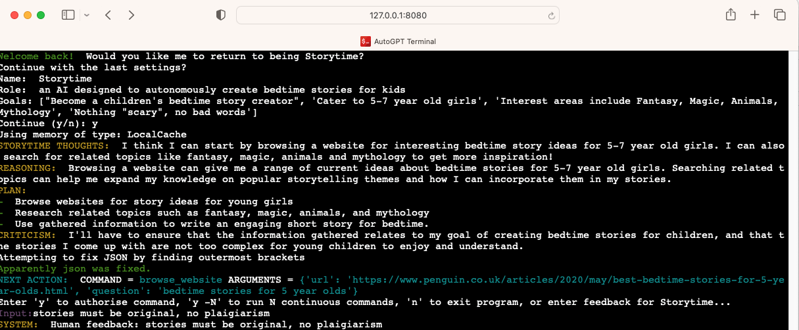

# Auto-GPT on Docker with Web Access

This repository provides a convenient and secure solution to run Auto-GPT in a Docker container with a web-based terminal. Running Auto-GPT in a Docker container isolates it from the host system, preventing accidental damage from commands like `rm -rf` or `apt install <whatever>`. Additionally, it ensures a consistent and easy-to-maintain environment.

## Features

- Runs Auto-GPT in a Docker container for improved security and maintainability
- Provides a browser-based terminal UI using [`gotty`](https://github.com/sorenisanerd/gotty)
- Accessible via `http://127.0.0.1:8080`, or by IP address

## Installation and Running

1. Clone the repository and navigate to the project directory
2. Copy the sample configuration file:

```
cp ai_settings.sample ai_settings.yaml
```

3. Edit `ai_settings.yaml` to suit your needs
4. Initialize the Auto-GPT JSON file and set the required permissions:

```
touch auto-gpt.json
chmod 644 auto-gpt.json
chmod 777 logs cache workspace
```

5. Build and run the Docker container:

```
docker-compose up -d --build
```


## Accessing the Terminal

To access the terminal UI via a browser, visit `http://127.0.0.1:8080` or the IP address of your running container. If you're unsure of the IP address, use the following command to check the logs:


```
docker logs autogpt-gotty
```


## TODO

- Check if `gotty` can pass audio from the `--speak` option
- Verify that integration with ElevenLabs is functional (should be okay, but untested)~




# Dockerhub

##### For reference only, this is not needed to run the `docker-compose` command above.

You can also find the pre-built image on Dockerhub at [cdukes/autogpt-gotty:latest](https://hub.docker.com/r/cdukes/autogpt-gotty). 

```
ARG GOTTY_VERSION=v1.5.0

FROM debian:bullseye-slim AS builder

ARG GOTTY_VERSION

WORKDIR /build

ADD https://github.com/sorenisanerd/gotty/releases/download/${GOTTY_VERSION}/gotty_${GOTTY_VERSION}_linux_arm64.tar.gz gotty-aarch64.tar.gz
ADD https://github.com/sorenisanerd/gotty/releases/download/${GOTTY_VERSION}/gotty_${GOTTY_VERSION}_linux_amd64.tar.gz gotty-x86_64.tar.gz

RUN tar -xzvf "gotty-$(uname -m).tar.gz"
RUN apt-get update
RUN apt-get install git -y
RUN git clone https://github.com/Torantulino/Auto-GPT.git

##############################

FROM python:3.11-slim

COPY --chmod=+x --from=builder /build/gotty /bin/gotty

WORKDIR /app

COPY --from=builder /build/Auto-GPT/ /app

RUN apt-get update && apt-get install git vim curl pkg-config
libcairo2-dev build-essential libgirepository1.0-dev
gstreamer1.0-tools gstreamer1.0-plugins-good gstreamer1.0-plugins-base
gir1.2-gst-plugins-base-1.0 sudo wget curl -y

ARG UID=1000
ARG GID=1000
RUN adduser --disabled-password --uid 1000 --home /app --gecos "" auto-gpt &&
pip install --upgrade pip &&
pip install --no-cache-dir -r requirements.txt &&
pip install pycairo PyGObject &&
chown -R 1000:1000 /app

USER 1000

ENV PINECONE_API_KEY=${PINECONE_API_KEY}
PINECONE_ENV=${PINECONE_ENV}
OPENAI_API_KEY=${OPENAI_API_KEY}
ELEVENLABS_API_KEY=${ELEVENLABS_API_KEY}
ELEVENLABS_VOICE_1_ID=${ELEVENLABS_VOICE_1_ID}
ELEVENLABS_VOICE_2_ID=${ELEVENLABS_VOICE_2_ID}
SMART_LLM_MODEL=${SMART_LLM_MODEL}
FAST_LLM_MODEL=${FAST_LLM_MODEL}
GOOGLE_API_KEY=${GOOGLE_API_KEY}
CUSTOM_SEARCH_ENGINE_ID=${CUSTOM_SEARCH_ENGINE_ID}
USE_AZURE=${USE_AZURE}
OPENAI_AZURE_API_BASE=${OPENAI_AZURE_API_BASE}
OPENAI_AZURE_API_VERSION=${OPENAI_AZURE_API_VERSION}
OPENAI_AZURE_DEPLOYMENT_ID=${OPENAI_AZURE_DEPLOYMENT_ID}
IMAGE_PROVIDER=${IMAGE_PROVIDER}
HUGGINGFACE_API_TOKEN=${HUGGINGFACE_API_TOKEN}
USE_MAC_OS_TTS=${USE_MAC_OS_TTS}

EXPOSE 8080

WORKDIR /app
```

